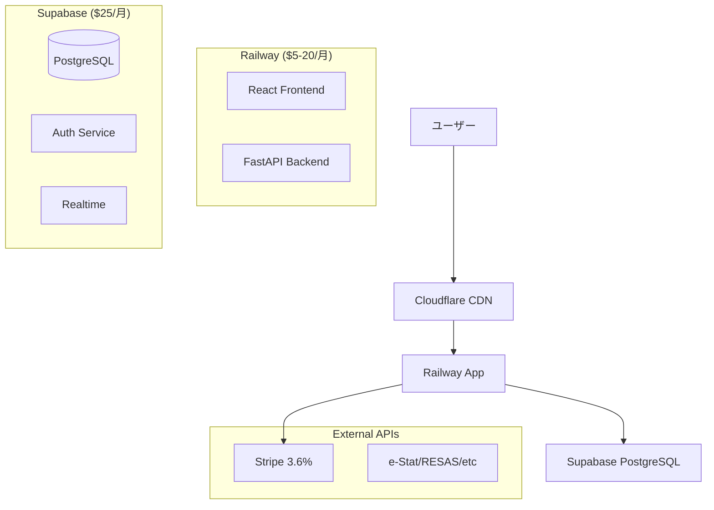

# クラウドプラットフォーム比較 - MVT Analytics System

## 🎯 要件
- 基本的に個人利用（スケーラビリティは重要度低）
- 課金機能付きSaaS化
- 低コスト運用
- セキュリティ確保

---

## 📊 プラットフォーム比較表

| プラットフォーム | 月額コスト | セットアップ | スケーラビリティ | 日本語対応 | 推奨度 |
|----------------|------------|-------------|----------------|------------|--------|
| **Railway + Supabase** | **$30-45** | ⭐⭐⭐⭐⭐ | ⭐⭐⭐⭐ | ⭐⭐⭐⭐ | **🏆推奨** |
| Vercel + PlanetScale | $40-60 | ⭐⭐⭐⭐ | ⭐⭐⭐⭐⭐ | ⭐⭐⭐ | ⭐⭐⭐⭐ |
| AWS ECS + RDS | $50-100 | ⭐⭐ | ⭐⭐⭐⭐⭐ | ⭐⭐ | ⭐⭐⭐ |
| GCP Cloud Run | $40-80 | ⭐⭐⭐ | ⭐⭐⭐⭐⭐ | ⭐⭐⭐ | ⭐⭐⭐⭐ |
| Digital Ocean | $25-40 | ⭐⭐⭐ | ⭐⭐⭐ | ⭐⭐ | ⭐⭐⭐ |

---

## 🏆 推奨: Railway + Supabase

### ✅ メリット
- **低コスト**: 月額$30-45から開始
- **簡単デプロイ**: GitHubからワンクリック
- **フルマネージド**: インフラ管理不要
- **認証内蔵**: Supabaseで認証・RLS完備
- **PostgreSQL**: 本格的DB機能
- **リアルタイム**: WebSocket対応

### 📈 コスト詳細
```
Railway (バックエンド + フロントエンド):
- Starter: $5/月 (500MB RAM, 1GB Storage)
- Developer: $10/月 (8GB RAM, 100GB Storage)  
- Team: $20/月 (32GB RAM, 250GB Storage)

Supabase:
- Free: $0 (500MB DB, 50,000 MAU)
- Pro: $25/月 (8GB DB, 100,000 MAU)

合計: $30-45/月
```

### 🚀 スケーリング路線
1. **Phase 1**: Railway Starter + Supabase Pro ($30/月)
2. **Phase 2**: Railway Developer + Supabase Pro ($35/月)
3. **Phase 3**: Railway Team + Supabase Pro ($45/月)
4. **Phase 4**: Supabase Team plan + 複数Railway ($100+/月)

---

## 💰 代替案の詳細

### Option 2: Vercel + PlanetScale
```
メリット:
- 優秀なフロントエンド体験
- Serverless Functions
- 自動スケーリング

デメリット:
- 高コスト (Pro: $20/月、DB: $20-40/月)
- 複雑なバックエンド構成

コスト: $40-60/月
```

### Option 3: AWS Minimal Setup
```
構成:
- ECS Fargate (最小): $30/月
- RDS PostgreSQL (t3.micro): $15/月
- CloudFront + S3: $5/月

メリット:
- AWSエコシステム
- 高度なサービス連携

デメリット:
- セットアップ複雑
- 管理負荷高

コスト: $50-100/月
```

### Option 4: Digital Ocean
```
構成:
- App Platform: $12/月
- Managed Database: $15/月

メリット:
- シンプル料金体系
- 高パフォーマンス

デメリット:
- 認証機能要自作
- 日本語情報少

コスト: $25-40/月
```

---

## 🔐 セキュリティ対策比較

| 項目 | Railway+Supabase | Vercel+PlanetScale | AWS | GCP |
|------|------------------|-------------------|-----|-----|
| **SSL/TLS** | ✅ 自動 | ✅ 自動 | ⚙️ 設定要 | ⚙️ 設定要 |
| **WAF** | 🔵 Cloudflare | ✅ 内蔵 | ⚙️ 別料金 | ⚙️ 別料金 |
| **DDoS保護** | 🔵 Cloudflare | ✅ 内蔵 | ⚙️ 別料金 | ⚙️ 別料金 |
| **認証** | ✅ Supabase Auth | ⚙️ 要実装 | ⚙️ Cognito | ⚙️ Firebase |
| **RLS** | ✅ 標準 | ❌ | ⚙️ 要実装 | ⚙️ 要実装 |

---

## 💳 課金システム統合

### Stripe統合パターン

#### 1. Railway + Supabase + Stripe
```typescript
// シンプルな課金フロー
const pricing = {
  free: { price: 0, projects: 1, analyses: 5 },
  basic: { price: 2980, projects: 10, analyses: 100 },
  pro: { price: 9800, projects: 100, analyses: 1000 }
}

// Supabase RLSで自動的にユーザー分離
// Stripe Webhookでプラン更新
```

#### 2. 課金機能の実装優先度
```
High Priority:
✅ ユーザー登録・認証
✅ プラン制限チェック  
✅ Stripe Checkout統合

Medium Priority:
🔄 使用量ダッシュボード
🔄 プラン変更機能
🔄 請求書発行

Low Priority:
📅 試用期間管理
📊 解約フロー
💰 クーポン機能
```

---

## 🎯 最終推奨アーキテクチャ



### 🚀 実装ロードマップ

#### Week 1: 基盤構築
- [ ] Supabase プロジェクト作成
- [ ] Railway デプロイメント
- [ ] 認証システム統合
- [ ] データベース移行

#### Week 2: 課金システム
- [ ] Stripe アカウント設定
- [ ] 課金フロー実装
- [ ] プラン制限機能
- [ ] Webhook処理

#### Week 3: セキュリティ・最適化
- [ ] Cloudflare設定
- [ ] セキュリティヘッダー
- [ ] Rate Limiting
- [ ] モニタリング設定

#### Week 4: テスト・本番化
- [ ] E2Eテスト
- [ ] パフォーマンステスト
- [ ] ドキュメント整備
- [ ] 本番リリース

---

## 📞 サポート・次のステップ

### 今すぐ始められるアクション
1. **Supabase無料アカウント作成** → データベース確認
2. **Railway無料枠テスト** → デプロイメント確認  
3. **Stripeアカウント作成** → 課金テスト
4. **独自ドメイン準備** → SEO・ブランディング

### 推定実装時間
- **Minimal SaaS**: 2-3週間
- **フル機能課金**: 4-6週間  
- **エンタープライズ**: 8-12週間

**総投資額**: 月額$30-45 + 開発時間のみ！ 